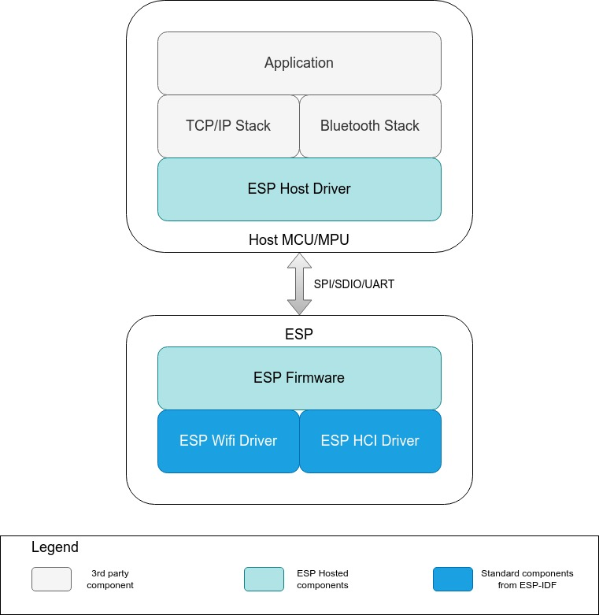

# ESP-Hosted

```diff
- You are currently viewing ESP-Hosted variant
```
ESP-Hosted is an open source solution that provides a way to use Espressif SoCs and modules as a communication co-processor. This solution provides wireless connectivity (Wi-Fi and BT/BLE) to the host microprocessor or microcontroller, allowing it to communicate with other devices.

Following is the high level block diagram for ESP-Hosted. Detailed block diagram is available in subsequent sections. 




## Variants

The ESP-Hosted solution is available in two variants as mentioned below. The differentiation factor here is the type of network interface presented to host and the way Wi-Fi on ESP SoC/module is configured/controlled. Both the variants have their respective host and firmware software. 

###  ESP-Hosted

This is a first generation ESP-Hosted solution. This is a variant provides a standard 802.3 (Ethernet) network interface to the host. Thought process behind this solution is to keep the host software simple while providing suite of connectivity features. 
In order to achieve this, the host is presented with following:

* A simple 802.3 network interface which essentially is an Ethernet interface
* A light weight control interface to configure Wi-Fi on ESP board
* A standard HCI interface

Although this variant supports Linux host, the nature of this solution makes it ideal to be used with MCU hosts which do not have complex communication interfaces such as Ethernet, Wi-Fi, BT/BLE etc.

This variant is available in <a href="https://github.com/espressif/esp-hosted/tree/ESP-Hosted_MCU_Host" target="_blank" rel="noopener">ESP-Hosted_MCU_Host</a> branch on <a href="https://github.com/espressif/esp-hosted" target="_blank" rel="noopener">github repository</a>.

Please proceed with the [detailed documentation](docs/README.md) for setup and usage instructions. 


### ESP-Hosted-NG

:bulb: Your current branch doesn't have this variant. This variant is available in <a href="https://github.com/espressif/esp-hosted" target="_blank" rel="noopener">master</a> branch on <a href="https://github.com/espressif/esp-hosted" target="_blank" rel="noopener">github repository</a>

> This is the Next-Generation ESP-Hosted solution specifically designed for hosts that run Linux operating system. This variant of the solution takes a standard approach while providing a network interface to the host. This allows usage of standard Wi-Fi applications such as wpa_supplicant to be used with ESP SoCs/modules.
> 
> This solution offers following:
> 
> * 802.11 network interface which is a standard Wi-Fi interface on Linux host
> * Configuration of Wi-Fi is supported through standard cfg80211 interface of Linux
> * A standard HCI interface
---


## ESP-Hosted vs ESP-Hosted-NG

Now that we offer two variants of this solution, it could cause a little confusion. This section will try to explains similarities and differences in both the variants and help you make a choice.

#### Similarities

- Both versions share the same aim, to conveniently use ESP's Wi-Fi and Bluetooth/BLE capabilities from host

- Both versions aim to support same set of ESP chipsets and same set of transports like SPI/SDIO/UART for connectivity needs

#### Key Differences

- ESP-Hosted supports both Linux and MCU hosts. ESP-Hosted-NG supports only Linux host.
- ESP-Hosted exposes 802.3 network interface (Ethernet) to the host. Where as, ESP-Hosted-NG exposes 802.11 interface (Wi-Fi).
- ESP-Hosted uses custom control path to configure Wi-Fi as opposed to ESP-Hosted-NG which uses standard nl80211/cfg80211 configuration.

#### Our Recommendation

* If you are using MCU host, you do not have choice but to use ESP-Hosted
* If you are using Linux host, we recommend ESP-Hosted-NG since it takes a standard approach which makes it compatible with widely used user space applications/services such as wpa_supplicant, Network Manager etc.


Following table summarizes this entire discussion.

| Category                                 | ESP-Hosted               | ESP-Hosted-NG             |
| :--------------------------------------- | :----------------------- | :------------------------ |
| Features Supported                       | 802.11 b/g/n, BT/BLE     | 802.11 b/g/n, BT/BLE      |
| Network Interface Type (exposed to host) | 802.3 Ethernet Interface | 802.11 Wi-Fi interface    |
| Wi-Fi Configuration mechanism            | Custom control interface | nl80211/cfg80211          |
| Station Interface                        | Supported (ethsta0)      | Supported (espsta0)       |
| SoftAP interface                         | Supported (ethap0)       | To be supported in future |
| HCI Interface                            | Supported                | Supported                 |
| Transport Layer                          | SDIO, SPI, UART          | SDIO, SPI, UART           |
| Recommended Host Type                    | MCU Host                 | Linux Host                |


