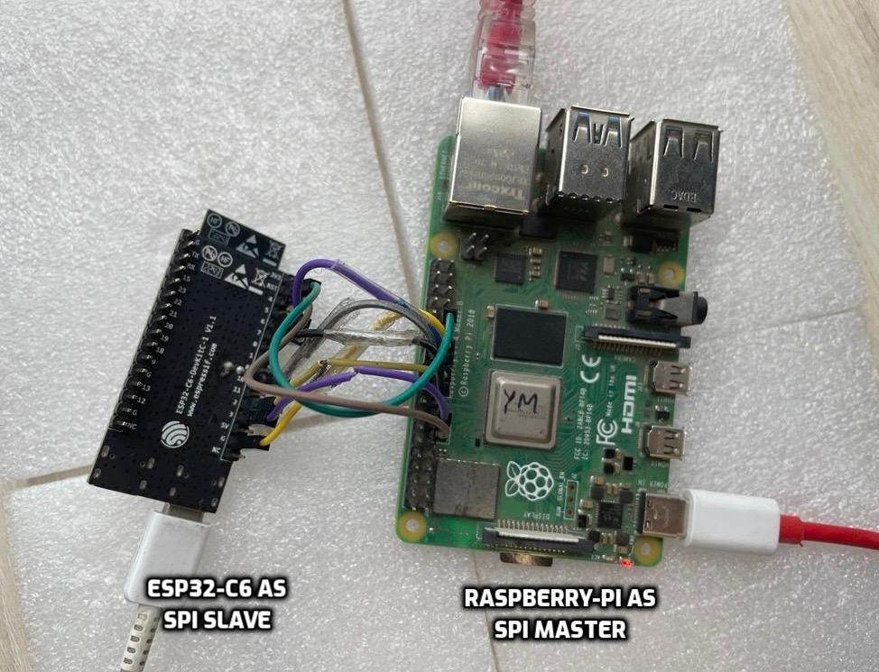

# Wi-Fi and BT/BLE connectivity Setup over SPI

| Supported Targets | ESP32 | ESP32-S2 | ESP32-S3 | ESP32-C2 | ESP32-C3 | ESP32-C6 |
| ----------------- | ----- | -------- | -------- | -------- | -------- | -------- |

## 1. Setup
### 1.1 Hardware Setup
In this setup, ESP board acts as a SPI peripheral and provides Wi-Fi capabilities to host. Please connect ESP peripheral to Raspberry-Pi with jumper cables as mentioned below. It may be good to use small length cables to ensure signal integrity. Power ESP and Raspberry Pi separately with a power supply that provide sufficient power. ESP can be powered through PC using micro-USB cable.

Raspberry-Pi pinout can be found [here!](https://pinout.xyz/pinout/spi)

#### 1.1.1 Pin connections
| Raspberry-Pi Pin | ESP32 | ESP32-S2/S3 | ESP32-C2/C3/C6 | Function |
|:-------:|:---------:|:--------:|:--------:|:--------:|
| 24 | IO15 | IO10 | IO10 | CS0 |
| 23 | IO14 | IO12 | IO6 | SCLK |
| 21 | IO12 | IO13 | IO2 | MISO |
| 19 | IO13 | IO11 | IO7 | MOSI |
| 25 | GND | GND | GND | Ground |
| 15 | IO2 | IO2 | IO3 | Handshake |
| 13 | IO4 | IO4 | IO4 | Data Ready |
| 31 | EN  | RST | RST | ESP32 Reset |

Sample SPI setup with ESP32-C6 as slave and RaspberryPi as Host looks like:




### 1.2 Raspberry-Pi Software Setup
The SPI master driver is disabled by default on Raspberry-Pi OS. To enable it add following commands in  _/boot/config.txt_ file
```
dtparam=spi=on
dtoverlay=disable-bt
```
In addition, below options are set as the SPI clock frequency in analyzer is observed to be smaller than expected clock. This is RaspberryPi specific [issue](https://github.com/raspberrypi/linux/issues/2286).
```
core_freq=250
core_freq_min=250
```
Please reboot Raspberry-Pi after changing this file.

## 2. Load ESP-Hosted Solution
### 2.1 Host Software
* Execute following commands in root directory of cloned ESP-Hosted repository on Raspberry-Pi
```sh
$ cd esp_hosted_fg/host/linux/host_control/
$ ./rpi_init.sh spi
```
* This script compiles and loads host driver on Raspberry-Pi. It also creates virtual serial interface `/dev/esps0` which is used as a control interface for Wi-Fi on ESP peripheral

### 2.2 ESP Peripheral Firmware
One can load pre-built release binaries on ESP peripheral or compile those from source. Below subsection explains both these methods.

#### 2.2.1 Load Pre-built Release Binaries
* Download pre-built firmware binaries from [releases](https://github.com/espressif/esp-hosted/releases)
* Follow `readme.txt` from release tarball to flash the ESP binary
* :warning: Make sure that you use `Source code (zip)` in `Assets` fold with associated release for host building.
* Windows user can use ESP Flash Programming Tool to flash the pre-built binary.
* Collect firmware log
    * Use minicom or any similar terminal emulator with baud rate 115200 to fetch esp side logs on UART
```sh
$ minicom -D <serial_port>
```
serial_port is device where ESP chipset is detected. For example, /dev/ttyUSB0

#### 2.2.2 Source Compilation

Make sure that same code base (same git commit) is checked-out/copied at both, ESP and Host

##### Set-up ESP-IDF
- :warning: Following command is dangerous. It will revert all your local changes. Stash if need to keep them.
- Install the ESP-IDF using script
```sh
$ cd esp_hosted_fg/esp/esp_driver
$ cmake .
```
- Set-Up the build environment using
```sh
$ . ./esp-idf/export.sh
# Optionally, You can add alias for this command in ~/.bashrc for later use
```

##### Configure, Build & Flash SPI ESP firmware
* Set slave chipset environment
```
$ cd network_adapter
$ rm -rf sdkconfig build
$ idf.py set-target <esp_chipset>
```

For SPI, <esp_chipset> could be onr of `esp32`, `esp32s2`, `esp32s3`, `esp32c2`, `esp32c3`, `esp32c6`
* Execute following command to configure the project
```
$ idf.py menuconfig
```
* This will open project configuration window. To select SPI transport interface, navigate to `Example Configuration ->  Transport layer -> SPI interface -> select` and exit from menuconfig.

* For ESP32-C3, select chip revision in addition. Navigate to `Component config → ESP32C3-Specific → Minimum Supported ESP32-C3 Revision` and select chip version of ESP32-C3.

* Use below command to compile and flash the project. Replace <serial_port> with ESP peripheral's serial port.
```
$ idf.py -p <serial_port> build flash
```
* Collect the firmware log using
```
$ idf.py -p <serial_port> monitor
```

## 3. Checking the Setup

- Firmware log
On successful flashing, you should see following entry in ESP log:

```
[   77.877892] Features supported are:
[   77.877901]   * WLAN
[   77.877906]   * BT/BLE
[   77.877911]     - HCI over SPI
[   77.877916]     - BLE
```

- Host log
    If the transport is setup correctly, you should receive INIT event similar to above from ESP to host in `dmesg` log

**If intended transport is SPI+UART, please continue ahead with UART setup**
