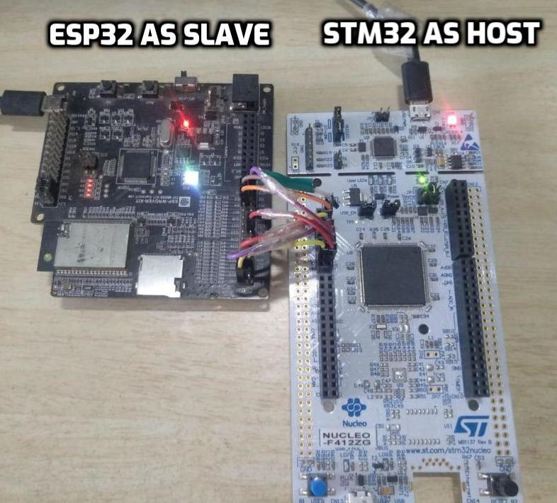

# Wi-Fi connectivity Setup over SDIO

| Supported Targets | ESP32 |
| ----------------- | ----- |

## 1. Setup
### 1.1 Hardware Setup/Connections
* In this setup, ESP board acts as a SDIO peripheral and provides Wi-Fi capabilities to host. Please connect ESP peripheral to STM32F412ZGT6-Nucleo 144 board's CN8 Extension connecter with jumper cables as mentioned below. It may be good to use small length cables to ensure signal integrity.
* Power ESP peripheral and STM32F412ZGT6-Nucleo 144 separately with a power supply that provide sufficient power. ESP peripheral and STM32 can be powered through USB-Hub using micro-USB cable. It is also used as USART connection for debug logs from host. Serial port communicaton program like tera term or minicom used to print the logs.
* Upcoming releases are expected to have:
    * BT/BLE stack integration at MCU side
    * ESP32-C6 support for MCU
    * ESP chipsets acting as Host MCU (ESP<-->ESP)
    * LWIP integration out of the box

#### Hardware connections for ESP32
| STM32 Pin | ESP32 Pin | Function |
|:----------:|:---------:|:--------:|
| PC8 (pin2) | IO2 | DATA0 |
| PC9 (pin4) | IO4 | DATA1 |
| PC10 (pin6) | IO12 | DATA2 |
| PC11 (pin8) | IO13 | DATA3 |
| PC12 (pin10)| IO14 | Clock |
| PD2 (pin12) | IO15 | Command |
| GND (pin13) | GND | Ground |
| PG2 (pin14) | EN | Reset ESP |

Setup image is here.



:warning: Note:
As SDIO faces signal integrity issues over jumper wires, we strongly recommend to **Design PCB boards with above connections**
If that is not possible
 - Try to use extremely small and good quality jumper wires
 - Join all possible grounds interconnected to lower noise


## 2. ESP Peripheral Firmware
One can load pre-built release binaries on ESP peripheral or compile those from source. Below subsection explains both these methods.

### 2.1 Load Pre-built Release Binaries
* Download pre-built firmware binaries from [releases](https://github.com/espressif/esp-hosted/releases)
* Follow `readme.txt` from release tarball to flash the ESP binary
* :warning: Make sure that you use `Source code (zip)` in `Assets` fold with associated release for host building.
* Windows user can use ESP Flash Programming Tool to flash the pre-built binary.
* Collect firmware log
    * Use minicom or any similar terminal emulator with baud rate 115200 to fetch esp side logs on UART
```sh
$ minicom -D <serial_port>
```
serial_port is device where ESP chipset is detected. For example, /dev/ttyUSB0


### 2.2 Source Compilation

Make sure that same code base (same git commit) is checked-out/copied at both, ESP and Host

##### Set-up ESP-IDF
- :warning: Following command is dangerous. It will revert all your local changes. Stash if need to keep them.
- Install the ESP-IDF using script
```sh
$ cd esp_hosted_fg/esp/esp_driver
$ cmake .
```
- Set-Up the build environment using
```sh
$ . ./esp-idf/export.sh
# Optionally, You can add alias for this command in ~/.bashrc for later use
```

##### Configure, Build & Flash SDIO ESP firmware
* Set slave chipset environment

```sh
$ cd network_adapter
$ rm -rf sdkconfig build
$ idf.py set-target <esp_chipset>
```
For SDIO, <esp_chipset> could be `esp32`
* Execute following command to configure the project
```sh
$ idf.py menuconfig
```
* This will open project configuration window. To select SDIO transport interface, navigate to `Example Configuration ->  Transport layer -> SDIO interface -> select` and exit from menuconfig.
* Use below command to compile and flash the project. Replace <serial_port> with ESP peripheral's serial port.
```sh
$ idf.py -p <serial_port> build flash
```
* Collect the firmware log using
```sh
$ idf.py -p <serial_port> monitor
```


## 3. Checking the Setup for SDIO
- Firmware log
On successful flashing, you should see following entry in ESP log:

```
[   77.877892] Features supported are:
[   77.877901]   * WLAN
[   77.877906]   * BT/BLE
[   77.877911]     - HCI over SDIO
[   77.877916]     - BT/BLE dual mode
```
- Host log
If the setup is functioning fine, you should receive `INIT` event from ESP chipset
